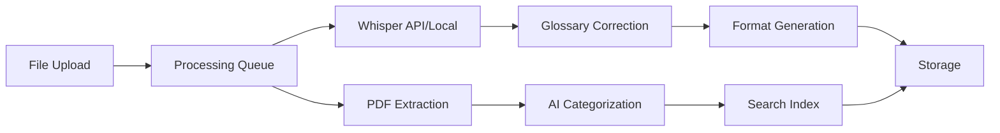

# QuiverDM - Extended Feature Documentation

## New Core Features

### Feature: Session Recording & Transcription System (P0)

**User Story**: As a DM, I want to upload audio/video recordings of my sessions and get AI-corrected transcripts, so I can focus on running the game instead of taking notes.

**Acceptance Criteria**:
- Given I upload an audio file (MP3/WAV/M4A), when processing completes, then I get timestamped transcript
- Given I upload a video file (MP4/MOV), when processed, then audio is extracted and transcribed
- Given I upload a PDF of session notes, when processed, then text is extracted and structured
- Given a transcript exists, when I review it, then campaign-specific terms are correctly identified
- Given a session is transcribed, when I request, then I can generate Discord/Table/Web formats

**Technical Requirements**:
- **Whisper Integration**: Local processing for privacy or OpenAI API for speed
- **File Processing**: Support files up to 500MB (4-hour sessions)
- **Glossary System**: Campaign-specific dictionary for names/places/items
- **Queue System**: Background processing with progress indicators
- **Storage**: CDN for media files, compressed storage for long-term

**UI/UX Components**:
- Upload dropzone with drag-and-drop
- Processing progress bar with time estimate
- Transcript editor with speaker identification
- Format selector with preview
- Glossary manager for custom terms

---

### Feature: Homebrew Content Library (P0)

**User Story**: As a DM, I want to import and organize all my homebrew content from PDFs, so I can quickly reference custom rules, items, and monsters during play.

**Acceptance Criteria**:
- Given I upload a homebrew PDF, when processed, then content is auto-categorized
- Given homebrew content exists, when I search, then I find items/spells/creatures instantly
- Given a creature stat block exists, when viewed, then it displays in proper 5e format
- Given images exist in PDFs, when extracted, then they are enhanced and tagged
- Given I'm in combat, when I add a homebrew creature, then stats auto-populate

**Technical Requirements**:
- **PDF Processing**: Apache PDFBox or pdf.js for extraction
- **OCR Capability**: Tesseract for scanned content
- **Image Processing**: Sharp/ImageMagick for enhancement
- **Categorization AI**: LLM for content classification
- **Search Indexing**: Elasticsearch or MeiliSearch for instant results

**Content Categories**:
- Magic Items (rarity, attunement, properties)
- Creatures (CR, stats, abilities, legendary actions)
- Spells (level, school, components, description)
- Locations (type, notable features, NPCs)
- Subclasses (class, features by level)
- Feats (prerequisites, benefits)
- Rules/Mechanics (category, description)

---

## Updated Architecture Requirements

### Data Models (Additional)

```javascript
SessionRecording {
  id, session_id, type: 'audio'|'video'|'pdf',
  original_url, file_size, duration_seconds,
  processing_status, transcript_id, created_at
}

Transcript {
  id, session_id, recording_id, raw_text,
  corrected_text, speakers[], timestamps[],
  glossary_matches[], formats: {
    discord: string,
    table: string,
    web_html: string
  }
}

CampaignGlossary {
  id, campaign_id, terms: [{
    term, type: 'npc'|'location'|'item'|'custom',
    variations: [], pronunciation_guide
  }]
}

HomebrewContent {
  id, campaign_id, source_pdf_id,
  type: 'item'|'creature'|'spell'|'location'|'subclass'|'feat',
  name, data: {}, images: [], tags: [],
  search_text, created_at
}

HomebrewPDF {
  id, campaign_id, filename, url,
  processing_status, extracted_count: {
    items: 0, creatures: 0, spells: 0, ...
  }
}
```

### Processing Pipeline Architecture



### API Endpoints (Additional)

```
# Recording & Transcription
POST   /api/sessions/:id/recordings
GET    /api/recordings/:id/status
GET    /api/transcripts/:id
PATCH  /api/transcripts/:id/corrections
POST   /api/transcripts/:id/generate-format

# Glossary
GET    /api/campaigns/:id/glossary
PATCH  /api/campaigns/:id/glossary/terms

# Homebrew Library  
POST   /api/homebrew/upload
GET    /api/homebrew/process-status/:id
GET    /api/homebrew/search
GET    /api/homebrew/content/:type
DELETE /api/homebrew/content/:id
```

### Storage Strategy

```yaml
Media Files:
  - AWS S3 / Cloudflare R2 for audio/video
  - Automatic compression after 30 days
  - Thumbnail generation for videos
  
Transcripts:
  - PostgreSQL for structured data
  - Full-text search indexes
  - Version history for corrections

Homebrew Content:
  - Document store for flexible schemas
  - CDN for extracted images
  - Vector embeddings for semantic search
```

### Processing Service Requirements

```javascript
// Whisper Service
class TranscriptionService {
  - Local Whisper (whisper.cpp) for privacy-conscious users
  - OpenAI Whisper API for cloud users
  - Fallback queue system
  - Speaker diarization
  - Timestamp alignment
}

// PDF Processing Service  
class HomebrewExtractor {
  - Table detection for stat blocks
  - Image extraction with OCR fallback
  - Multi-column layout handling
  - Cross-reference linking
  - Metadata preservation
}

// AI Correction Service
class ContentProcessor {
  - Campaign context injection
  - Glossary matching with fuzzy search
  - Format-specific generation
  - Consistency validation
}
```

## Updated Screen Designs Needed

### Screen 11: Session Upload & Processing

**Purpose**: Upload and monitor transcription progress
**Components**:
- Drag-drop upload zone
- File type selector (Audio/Video/PDF)
- Processing queue with progress bars
- Glossary term highlighter
- Preview pane with waveform/thumbnails

### Screen 12: Transcript Editor

**Purpose**: Review and correct AI transcriptions
**Components**:
- Split view: Audio player + synchronized text
- Speaker assignment dropdown
- Glossary term tagger
- Correction mode with track changes
- Format preview tabs (Discord/Table/Web)

### Screen 13: Homebrew Library

**Purpose**: Browse and search all homebrew content
**Components**:
- Category filter tabs
- Card grid with type icons
- Quick preview on hover
- Stat block formatter
- Image gallery view
- Bulk import status

### Screen 14: Homebrew Detail View

**Purpose**: View/edit individual homebrew content
**Components**:
- Type-specific layout (creature stats, item cards, spell format)
- Image carousel if multiple
- Source PDF reference link
- Quick-add to session button
- Edit mode with validation

## Performance Considerations

### Transcription Processing
- **Client-side option**: WebAssembly Whisper for privacy
- **Chunking**: Process in 10-minute segments
- **Queue limits**: Max 3 concurrent processes per user
- **Background workers**: Separate service for processing

### Homebrew Search
- **Indexing strategy**: Incremental updates
- **Caching**: Popular content in Redis
- **Pagination**: Virtual scroll for large libraries
- **Image optimization**: WebP with fallbacks

## Additional Tech Stack Requirements

```javascript
// Media Processing
- FFmpeg (audio extraction from video)
- Whisper.cpp or OpenAI Whisper API
- Speaker diarization (pyannote-audio)

// Document Processing
- PDF.js or Apache PDFBox
- Tesseract.js for OCR
- Sharp for image processing

// Search & AI
- MeiliSearch or Typesense (typo-tolerant search)
- OpenAI API or local LLM for corrections
- pgvector for semantic search

// Storage
- S3-compatible object storage
- CDN for media delivery
- Redis for processing queues
```

## Cost Considerations

### API Costs (Monthly estimates for 100 active DMs)
- Whisper API: ~$500 (4 hours/week/DM)
- LLM corrections: ~$200  
- Storage (S3): ~$100
- CDN bandwidth: ~$50

### Self-hosted Alternative Stack
- Whisper.cpp on user device
- Local LLM (Llama 2)
- MinIO for storage
- Reduced monthly cost to ~$50 for infrastructure

## MVP Adjustments with New Features

### Phase 1 (Weeks 1-3): Core + Upload
- Basic campaign/session management
- File upload infrastructure
- Processing queue setup
- Simple transcript display

### Phase 2 (Weeks 4-6): AI Processing
- Whisper integration (API first)
- Basic glossary system
- Format generation
- Homebrew PDF upload

### Phase 3 (Weeks 7-9): Enhancement
- Homebrew categorization
- Advanced search
- Speaker identification
- Local Whisper option

### Phase 4 (Weeks 10-12): Polish
- Batch processing
- Image enhancement
- Semantic search
- Performance optimization

## Critical Questions for These Features

1. **Privacy vs Convenience**: Default to local or cloud processing?
2. **Storage Limits**: How long to retain original media files?
3. **Glossary Sharing**: Community glossaries or campaign-only?
4. **Copyright**: How to handle copyrighted content in PDFs?
5. **Processing Priority**: Real-time or batch processing?
6. **Free Tier**: Include transcription in free plan?
7. **Mobile Upload**: Support recording directly in-app?
8. **Integration**: Connect to popular recording apps (OBS, Zoom)?

## Success Metrics for New Features

- **Transcription Accuracy**: 90%+ with glossary correction
- **Processing Time**: <5 minutes per hour of audio
- **Homebrew Import**: 95% successful categorization
- **Search Speed**: <200ms for homebrew content
- **Format Generation**: <2 seconds per format
- **User Adoption**: 60% use transcription features monthly
